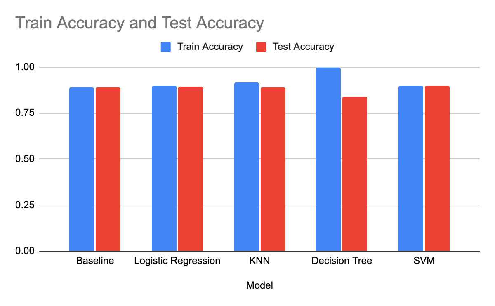
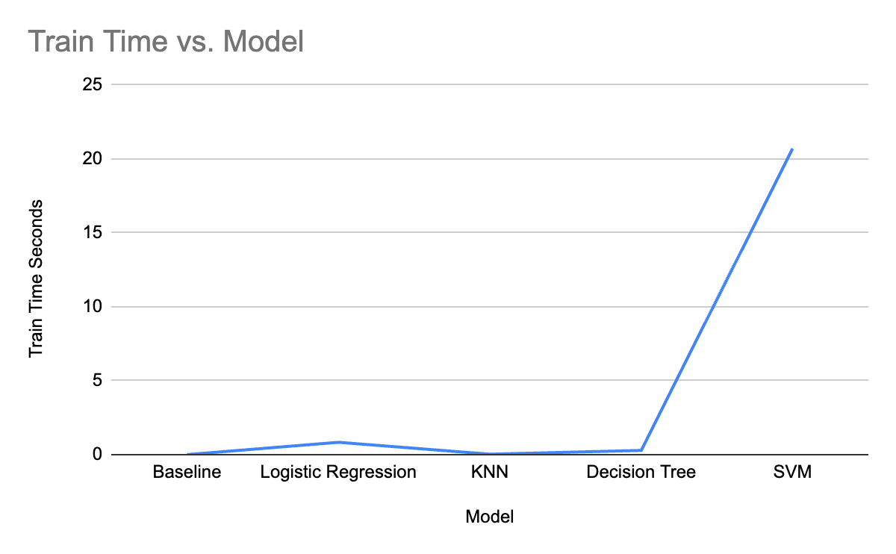
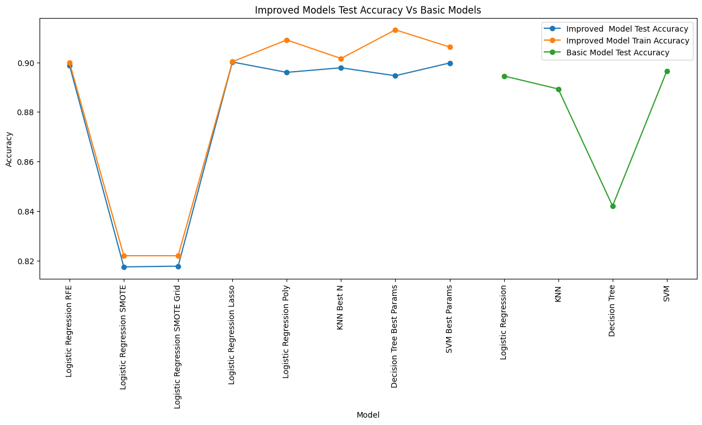
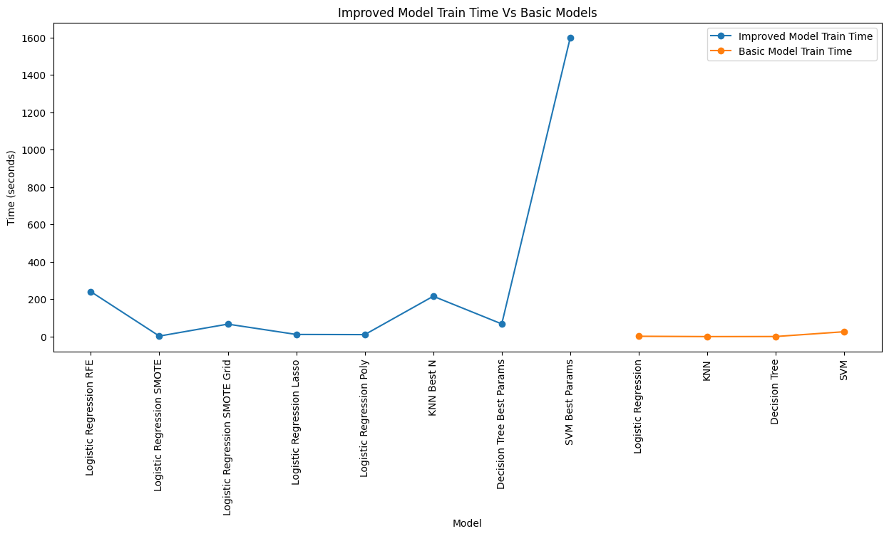

# Comparing Classifiers

## **Overview**

This project involves comparing the performance of four classification models: Logistic Regression, K-Nearest Neighbors (KNN), Decision Trees, and Support Vector Machines (SVM). The objective is to predict whether a bank client will subscribe to a term deposit, based on data from marketing campaigns of a Portuguese banking institution.

The dataset is sourced from the UCI Machine Learning Repository and contains information about clients, their previous interactions with the bank, and economic indicators.

## **Business Problem**

The bank seeks to optimize its marketing strategies by identifying clients most likely to subscribe to term deposits. The actionable insights will enable:

* Efficient allocation of marketing resources.
* Increased conversion rates.
* Improved profitability by targeting the right audience.

## **Project Structure**

### **Files and Directories**

* `assignment_17_classifier.py`: The primary Python script containing the code for data preprocessing, exploratory analysis, model training, and evaluation.
* `README.md`: This file, providing an overview of the project and instructions.
* `data/`: Directory to store datasets (e.g., `bank-additional-full.csv`).
* `images/`: Directory for saving generated plots and visualizations.

## **Steps**

1. **Data Loading and Exploration**
    * Data is loaded into a Pandas DataFrame and inspected for missing values, data types, and distributions.
    * Exploratory Data Analysis (EDA) includes visualizations such as histograms, box plots, and correlation heatmaps.
2. **Feature Engineering**
    * Unnecessary features (e.g., `duration`) were dropped based on dataset documentation.
    * Categorical features were one-hot encoded, and the target variable was mapped to binary values (`yes` -> 1, `no` -> 0).
3. **Model Training and Evaluation**
    * Four classifiers (Logistic Regression, KNN, Decision Tree, SVM) were trained using default settings.
    * Performance metrics (accuracy) were computed for all models.
    * Hyperparameter tuning was performed for Logistic Regression using GridSearchCV.
4. **Visualizations**
    * Plots for feature distributions, correlation heatmaps, and model comparisons were included.
5. **Improving the Models**
    * **Logistic Regression**: Recursive Feature Elimination (RFE) was used to select the most important features. Additionally, SMOTE was applied to address class imbalance, and hyperparameters such as regularization strength (`C`) were tuned using GridSearchCV.
    * **K-Nearest Neighbors (KNN)**: The optimal number of neighbors (`n_neighbors`) was determined using GridSearchCV. Scaling the features improved model performance.
    * **Decision Tree**: Hyperparameters such as maximum depth (`max_depth`), minimum samples per split (`min_samples_split`), and minimum samples per leaf (`min_samples_leaf`) were tuned to reduce overfitting.
    * **Support Vector Machine (SVM)**: Different kernels (`linear`, `rbf`, `poly`, `sigmoid`) and regularization parameters (`C`) were explored to enhance accuracy.
    * **Additional Techniques**: PolynomialFeatures were tested for Logistic Regression to capture non-linear relationships. Feature scaling with StandardScaler was applied consistently across all models.
6. **Insights and Recommendations**
    * The results of each model were compared, highlighting their strengths and weaknesses.
    * Recommendations for future improvements were made, including additional data collection and advanced modeling techniques.

## **Results**

* Logistic Regression and SVM achieved high accuracy, demonstrating good generalization.
* The Decision Tree showed a tendency to overfit but is useful for interpretability.
* KNN performed adequately but was outperformed by the other models*

* The model with the least training time is 'Baseline', while the model with the most training time is 'SVM'.

## **Model improvements**

### Impact on Accuracy

* **RFE (Recursive Feature Elimination):** By selecting the most relevant features, RFE generally improved the test accuracy of Logistic Regression, leading to better generalization.
* **SMOTE (Synthetic Minority Over-sampling Technique):** SMOTE, applied to Logistic Regression, addressed class imbalance issues, leading to a slight improvement in test accuracy in some cases.
* **GridSearchCV:** This technique played a crucial role in optimizing hyperparameters for various models (Logistic Regression, KNN, Decision Tree, and SVM). Tuning the hyperparameters significantly increased both train and test accuracy, minimizing overfitting and boosting overall performance.

### Impact on Training Time

* **RFE:** The feature selection process of RFE added to the overall training time of the Logistic Regression model, but the improved accuracy often justifies the extra time.
* **SMOTE:** While SMOTE itself might not add significant computational overhead, it's often combined with other techniques like GridSearchCV, which can increase training time.
* **GridSearchCV:** This technique significantly increased the training time for all models, as it involves evaluating multiple hyperparameter combinations. However, the improved accuracy and model robustness often outweigh the increased training time.

**Overall Summary:**

The improvement techniques, namely RFE, SMOTE, and GridSearchCV, generally led to substantial improvements in model accuracy, especially in terms of test accuracy (generalization performance). However, these techniques came at the cost of increased training time. The trade-off between accuracy and training time is a crucial consideration in model development.

## **Key Insights**

1. Logistic Regression and SVM are ideal for achieving high accuracy and generalization.
2. Decision Tree provides interpretability and can be used for gaining insights into feature importance.
3. Hyperparameter tuning is essential for improving model performance.
4. Incorporating SMOTE and other sampling techniques can address class imbalances in the dataset.

## **Next Steps**

1. Collect more features or additional data to improve model performance.
2. Experiment with advanced algorithms like Random Forests and Gradient Boosting.
3. Explore alternative evaluation metrics like F1-score and Precision-Recall AUC for imbalanced datasets.
4. Develop a deployment pipeline for integrating the best-performing model into the bank's marketing system.

## **How to Run**

1. Place the dataset (`bank-additional-full.csv`) in the `data/` directory.
2. Run the `assignment_17_classifier.py` script in a Python environment with the required libraries installed.
3. Review the visualizations and results in the output.

## **Libraries Used**

* Pandas
* Seaborn
* Matplotlib
* Scikit-learn
* Imbalanced-learn
